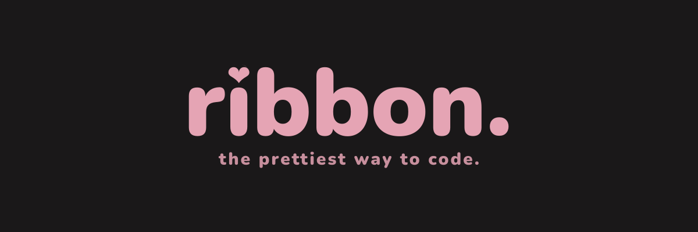

    
       
    
    
    
    

---

ribbon is a boutique code editor.

### features.
- **gpu rendering:** powered by [`wgpu`](https://wgpu.rs/).
- **scriptable:** the entire interface and editor logic are written in [lua](https://lua.org/).
- **quiet design:** built with a minimal visual footprint.

### architecture.

there is a very strict split in the architecture:

1. **the rust core:** does the boring stuff. memory management, drawing pixels on the screen and reading files.
2. **the lua userland:** does the fun stuff. keybinds, ui layout and custom commands. you have full control over this part.

### customizing.

customizing ribbon is straightforward. if you want to change something, you just write lua.

### contributing.

contributions are welcome. whether it is optimizing the rust core or designing a new theme, feel free to open an
[issue](https://github.com/gulce777/ribbon/issues) or a [pull request](https://github.com/gulce777/ribbon/pulls).

### license.

[unlicense](license). it belongs to you now.
